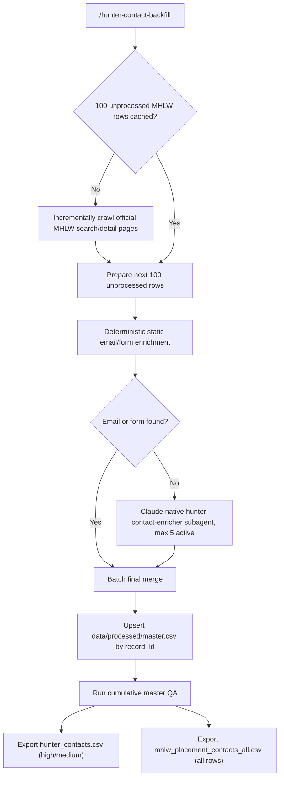

# Japan Headhunter Contact Research

This repository builds a local, source-traceable dataset of Japan recruitment/headhunter company contacts from the official MHLW public occupational placement business source.

## Main Outputs

- `hunter_contacts.csv`: human-facing accepted hunter/contact CSV with Chinese headers. This file includes only rows whose `猎头匹配度` is `high` or `medium`.
- `mhlw_placement_contacts_all.csv`: human-facing all-processed MHLW occupational-placement contacts CSV with Chinese headers. This file includes `low` and `exclude` rows for audit and later review.
  - Includes `猎头匹配度` (`high`, `medium`, `low`, `exclude`) and `猎头匹配理由`.

## Machine Outputs

- `data/manifest/mhlw_manifest.csv`: incremental MHLW official row cache discovered so far.
- `data/manifest/mhlw_manifest.jsonl`: machine-readable manifest cache.
- `data/manifest/checkpoint.json`: incremental MHLW crawl cursor/status.
- `data/processed/master.csv`: canonical machine-readable enriched master.
- `data/processed/master_zh.csv`: canonical enriched master with Chinese headers.
- `data/processed/master_qa_report.md`: cumulative master QA report with validation failures and potential duplicate contact-key findings.
- `data/runs/<run_id>/`: per-run batch, logs, static enrichment, agent prompts/results, raw evidence, and QA report.
  - Agent retry/quarantine state lives under each run's `agents/` directory: `retry_state.json`, `quarantine.jsonl`, `failed_results/`, and `retry_prompts/`.
- `data/raw/mhlw/`: raw official MHLW HTML evidence.

Generated business data is intentionally tracked by git so another operator can clone the repository and continue from the committed progress.

## Git Tracking Policy

The repository tracks code, tests, docs, Claude prompts, baseline files, and resumable business data.

Tracked resumable data includes:

- `data/manifest/`: MHLW manifest cache and checkpoint. This lets the next operator continue discovery instead of starting the official crawl from scratch.
- `data/processed/`: cumulative machine master, Chinese master, and QA report. `data/processed/master.csv` is the main resume boundary because already-processed `record_id` values are skipped.
- `hunter_contacts.csv`: accepted `high`/`medium` hunter-likelihood export.
- `mhlw_placement_contacts_all.csv`: all processed rows, including `low` and `exclude`.
- `data/runs/`: per-run batches, static outputs, agent prompts/results, retry/quarantine state, logs, and batch QA.
- `data/raw/`: raw MHLW/Dokobot evidence and manual observations used for auditability.

The repository does not track local environments or Python/test caches:

- `.venv/`, `.pytest_cache/`, `__pycache__/`, and `*.pyc`

## Requirements

A fresh clone does not include a virtual environment, browser bridge, or Claude runtime. It does include whatever resumable data has been committed. Install these external dependencies on each machine:

- `git`
- `uv` for Python environment management. See the official uv installation docs: <https://docs.astral.sh/uv/getting-started/installation/>.
- Python 3.12 managed by `uv`.
- Chrome.
- Dokobot browser extension, Dokobot CLI, and the local Chrome bridge for evidence reads. Dokobot's quick setup documents `npm i -g @dokobot/cli` and `dokobot install-bridge`: <https://dokobot.ai/help/agent-features>.
- Claude Code CLI or Claude Code Desktop Code tab for the full automated workflow with project slash commands and native `Agent` subagents. Claude Code setup is documented at <https://docs.claude.com/en/docs/claude-code/setup>; Claude Code Desktop is documented at <https://code.claude.com/docs/en/desktop>.
- Claude Code may require a one-time workspace trust confirmation. Run `claude` once from the repository root and trust the folder before using project slash commands.

## Setup

```bash
uv sync --python 3.12
uv run python --version
uv run python -m pytest -q
```

Run the deterministic dependency preflight before starting a production batch:

```bash
python3 scripts/hunter_preflight.py
```

The preflight prints Chinese remediation guidance and exits non-zero if `uv`, Python 3.12 through `uv`, Chrome, Dokobot CLI, Dokobot local bridge, or the Dokobot Chrome plugin/device connection is missing or not ready.

Verify browser and Claude dependencies when using the full automated flow:

```bash
dokobot --help
dokobot doko list
claude --version
claude doctor
```

For Claude Code Desktop, open the Claude Desktop app's Code tab, choose this repository folder, and use the integrated terminal to verify `dokobot --help`, `dokobot doko list`, and `uv run python -m pytest -q`. The Code tab uses the same underlying Claude Code engine as the CLI, but has separate session history and a graphical workflow.

## Fresh Clone Use Flow

On another machine:

For non-technical operators: after downloading/cloning this repository, you must open or enter the `hunterdata` project folder before using this workflow. The project slash command `/hunter-contact-backfill` exists inside this repository under `.claude/commands/`, so Claude Code can only see it when the current working folder is this project folder.

```bash
git clone <repo-url>
cd hunterdata
uv sync --python 3.12
uv run python -m pytest -q
python3 scripts/hunter_preflight.py
```

Then install and verify Chrome, the Dokobot browser extension, Dokobot CLI, the Dokobot local bridge, and either Claude Code CLI or Claude Code Desktop as listed above.

CLI path:

```bash
claude
```

Then run:

```text
/hunter-contact-backfill
```

Desktop Code path:
- Open Claude Desktop.
- Switch to the Code tab.
- Open this repository folder, usually named `hunterdata`.
- Make sure the Code tab's current project/folder is the cloned `hunterdata` folder before typing any slash command.
- Confirm the project slash command is available, then run `/hunter-contact-backfill`.

If `/hunter-contact-backfill` is not shown or cannot be run, first check that Claude Code Desktop opened the cloned `hunterdata` project folder. Opening a parent folder, another folder, or normal Claude Desktop Chat/Cowork will not load this repository's project slash command.

Each run updates tracked resumable data under `data/manifest/`, `data/raw/`, `data/runs/`, `data/processed/`, and the two root export CSVs. After a successful partial run, commit and push those data changes together with any code/prompt changes so the next operator can continue from the same `record_id` boundary.

## Data Handoff And Reset

To hand off partial progress after running a few batches:

```bash
git status --short
uv run python -m pytest -q
git add data hunter_contacts.csv mhlw_placement_contacts_all.csv
git commit -m "data: update hunter contact progress"
git push
```

The next operator can clone or pull that commit and run `/hunter-contact-backfill`; completed rows are skipped by `record_id` values already present in `data/processed/master.csv`.

To intentionally start over from an empty baseline, remove the tracked data outputs in a normal commit. Do not use `git clean` for business data reset; the resumable data is tracked now.

## Claude Desktop Modes

Claude Desktop has multiple modes. The distinction matters for this repository:

- Claude Code Desktop, the Code tab in Claude Desktop, is an equivalent supported runtime for this repository's automated workflow when it is opened on this repository folder. It runs the same underlying Claude Code engine as the CLI, with a graphical interface, integrated terminal, file editor, diff/review panes, and separate session history.
- Claude Code CLI remains the best option when operators need shell-native scripting, automation, or exact terminal workflow.
- Claude Desktop Chat and Claude Cowork are not the same as opening this repository in Claude Code Desktop's Code tab.

If an operator uses Claude Desktop Chat or Cowork rather than the Code tab, treat it as manual operator mode for this repository:

- Run Python commands in Terminal from the repo root.
- Use generated prompt files under `data/runs/<run_id>/agents/prompts/` as manual work packets.
- Paste a prompt packet into Claude Desktop and perform browser research with the same evidence rules.
- Write the result JSONL and raw evidence files exactly where the prompt requests, or use an approved local Desktop extension/MCP setup that can write those files.
- Run the repository validators and merge commands from Terminal. Do not merge Desktop-generated output without passing the same validator gates.

Recommended automated modes are Claude Code CLI or Claude Code Desktop Code tab. Chat/Cowork-only operation is slower and more manual because orchestration, subagent concurrency, Dokobot reads, local file writes, and validation must be driven outside the repository's Claude Code workflow or through separately configured local tools.

## Source Rules

MHLW `人材サービス総合サイト` is the primary business verification source.
Company websites are the preferred source for email, phone, and contact form URLs.
MHLW proves occupational-placement licensing, but does not by itself prove a company is a headhunter. The pipeline keeps all official rows and classifies `hunter_likelihood` from official/public business evidence.

Field semantics:
- `source_url` / `基础来源URL`: the original/base source for the row, usually the MHLW detail page when the row enters the pipeline.
- `mhlw_source_url` / `厚生劳动省来源URL`: the official MHLW verification page.
- `email_source_url` / `邮箱或表单证据URL`: the public page where the email, contact form, or no-contact official-site evidence was confirmed.

Do not collect private social profiles, login-only data, paid database data, inferred email patterns, or personal non-business contact details.

## Recommended Claude Code Flow

Open Claude Code from the repository root:

```bash
claude
```

Process the next unprocessed batch of 100 rows:

```text
/hunter-contact-backfill
```

Run `/hunter-contact-backfill` again on the next day/session to continue. The command first ensures the local MHLW cache has 100 unprocessed official rows, then processes those rows. Completed rows are determined by `record_id` values already present in `data/processed/master.csv`; new batches are upserted by `record_id`, not appended blindly. The default batch size is 100, and the final remaining batch may be smaller. After each upsert, `hunter_contacts.csv` is regenerated from accepted `high`/`medium` rows, while `mhlw_placement_contacts_all.csv` keeps every processed row.

## Pipeline



## Manual Smoke Tests

Manifest smoke:

```bash
mkdir -p data/runs/smoke/manifest
uv run python -m scripts.mhlw_manifest \
  --manifest-csv data/runs/smoke/manifest/mhlw_manifest.csv \
  --manifest-jsonl data/runs/smoke/manifest/mhlw_manifest.jsonl \
  --checkpoint data/runs/smoke/manifest/checkpoint.json \
  --raw-dir data/runs/smoke/manifest/raw \
  --limit 5 \
  --sleep-seconds 0
```

Prepare a small resumable batch, fetching official MHLW rows if needed:

```bash
mkdir -p data/runs/smoke
uv run python -m scripts.hunter_resume prepare-next-batch \
  --ensure-mhlw \
  --manifest-csv data/manifest/mhlw_manifest.csv \
  --manifest-jsonl data/manifest/mhlw_manifest.jsonl \
  --manifest-checkpoint data/manifest/checkpoint.json \
  --mhlw-raw-dir data/raw/mhlw \
  --master-csv data/processed/master.csv \
  --batch-csv data/runs/smoke/batch.csv \
  --limit 5 \
  --mhlw-sleep-seconds 0
```

Run tests:

```bash
uv run python -m pytest -q
```

## Claude Agent Backfill Notes

The `/hunter-contact-backfill` command is the main orchestrator prompt. It runs deterministic Python stages, dispatches native `hunter-contact-enricher` subagents, monitors raw Dokobot evidence, and runs the strict merge. It does not use `claude -p`, and Python is not responsible for managing Claude subagents.

Model policy:
- The main Claude Code orchestrator uses the operator's current/default model. The slash command does not override it.
- The project `hunter-contact-enricher` subagent is pinned to `model: haiku` in its frontmatter.

The subagent result JSONL must include `hunter_likelihood` and `hunter_likelihood_reason` for each row. Static enrichment sets a conservative value first; the subagent may update it using official/public evidence.

Prompt boundaries:
- `/hunter-contact-backfill` is a strong-process runbook. It owns batch size, active-agent slots, static-stream monitoring, retry/quarantine decisions, and merge gates.
- `hunter-contact-enricher` is exploratory within strict boundaries. It can use WebSearch/WebFetch only to discover candidate official pages, then must use local Dokobot raw evidence for the final accepted source. It must not edit CSVs, infer email patterns, submit forms, use paid/login-only/private sources, or use search snippets/directories as final evidence.
- The validator, not the subagent summary, decides completion. Accepted agent results need schema-valid JSONL, status/field consistency, local Dokobot raw evidence, Dokobot metadata, same-company identity evidence, and a source URL matching the raw Dokobot metadata site.

Agent completion is strict. A result is not complete merely because a JSONL line exists. The validator checks schema, status/field consistency, raw local Dokobot evidence, Dokobot metadata, and same-company evidence. `not_found` is accepted when the raw evidence proves the exact company was checked and does not include email/form fields. `error`, wrong-company evidence, invalid JSON, inconsistent status fields, or missing raw evidence should be recorded with `--record-agent-failure`; the helper archives the bad result, resets the result file, and either creates a retry prompt or quarantines the batch after the attempt limit.

The subagent must use:

```bash
uv run python -m scripts.dokobot_local_read "<url>" -o "<raw_path>" --timeout 120
```

The wrapper delegates tab management to Dokobot using local Chrome bridge + reuse-tab behavior and writes a sibling `.meta.json` audit file.

## Legacy Compatibility

`scripts.collect_contacts` and the older full-workflow defaults in `scripts.claude_agent_workflow` are retained for historical tests and compatibility with the first 100-row research prototype. The recommended operator entrypoint is the Claude Code `/hunter-contact-backfill` command above. Direct use of the old `japan_headhunters_*` flow requires the explicit `--legacy-prototype-workflow` flag.
