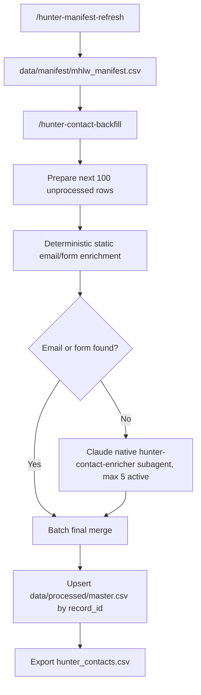

# Japan Headhunter Contact Research

This repository builds a local, source-traceable dataset of Japan recruitment/headhunter company contacts from the official MHLW public occupational placement business source.

## Main Output

- `hunter_contacts.csv`: human-facing final CSV with Chinese headers.

## Machine Outputs

- `data/manifest/mhlw_manifest.csv`: full MHLW manifest baseline.
- `data/manifest/mhlw_manifest.jsonl`: machine-readable manifest.
- `data/manifest/checkpoint.json`: manifest refresh checkpoint/status.
- `data/processed/master.csv`: canonical machine-readable enriched master.
- `data/processed/master_zh.csv`: canonical enriched master with Chinese headers.
- `data/runs/<run_id>/`: per-run batch, logs, static enrichment, agent prompts/results, raw evidence, and QA report.
- `data/raw/mhlw/`: raw official MHLW HTML evidence.

Generated runtime data is intentionally ignored by git, except for `.gitkeep` placeholders and source/example files.

## Requirements

- `uv`
- Python 3.12 managed by `uv`
- Dokobot CLI (`dokobot --help` should work)
- Chrome + Dokobot local bridge for agent evidence reads
- Claude Code CLI for native subagent orchestration (`claude auth status` should succeed)
- Claude Code may require a one-time workspace trust confirmation. Run `claude` once from the repository root and trust the folder before using project slash commands.

## Setup

```bash
uv sync --python 3.12
uv run python --version
```

## Source Rules

MHLW `人材サービス総合サイト` is the primary business verification source.
Company websites are the preferred source for email, phone, and contact form URLs.

Do not collect private social profiles, login-only data, paid database data, inferred email patterns, or personal non-business contact details.

## Recommended Claude Code Flow

Open Claude Code from the repository root:

```bash
claude
```

First refresh the full official manifest:

```text
/hunter-manifest-refresh
```

Then process the next unprocessed batch of 100 rows:

```text
/hunter-contact-backfill
```

Run `/hunter-contact-backfill` again on the next day/session to continue from the next unprocessed manifest rows. Completed rows are determined by `record_id` values already present in `data/processed/master.csv`; new batches are upserted by `record_id`, not appended blindly. The default batch size is 100, and the final remaining batch may be smaller.

## Pipeline



## Manual Smoke Tests

Manifest smoke:

```bash
uv run python -m scripts.mhlw_manifest --limit 5 --sleep-seconds 0
```

Prepare a small resumable batch from an existing manifest:

```bash
mkdir -p data/runs/smoke
uv run python -m scripts.hunter_resume prepare-next-batch \
  --manifest-csv data/manifest/mhlw_manifest.csv \
  --master-csv data/processed/master.csv \
  --batch-csv data/runs/smoke/batch.csv \
  --limit 5
```

Run tests:

```bash
uv run python -m pytest -q
```

## Claude Agent Backfill Notes

The `/hunter-contact-backfill` command is the main orchestrator prompt. It runs deterministic Python stages, dispatches native `hunter-contact-enricher` subagents, monitors raw Dokobot evidence, and runs the strict merge. It does not use `claude -p`, and Python is not responsible for managing Claude subagents.

The subagent must use:

```bash
uv run python -m scripts.dokobot_local_read "<url>" -o "<raw_path>" --timeout 120
```

The wrapper delegates tab management to Dokobot using local Chrome bridge + reuse-tab behavior and writes a sibling `.meta.json` audit file.
